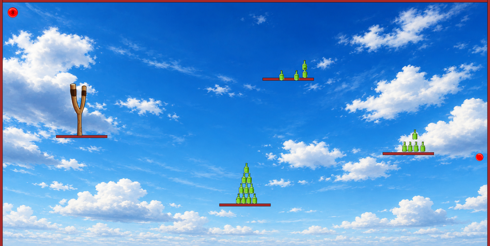

# Bottle Blaster

Bottle Blaster is a browser-based physics game where players use a slingshot to launch balls at bottle structures placed across floating platforms. Each shot must be carefully aimed to knock down as many bottles as possible while managing a limited number of balls. The challenge comes from the different bottle formations and platform positions, requiring both precision and strategy to clear every target.

Built with **JavaScript**, **p5.js**, and **Matter.js**, this project explores physics-based gameplay, collision detection, projectile motion, and interactive web development. Inspired by classic slingshot games, it features realistic physics interactions, destructible bottle structures, limited ammunition, and custom win/lose screens.

---

## Preview

### Gameplay


### Mid Game




---

## Features

* Physics simulation powered by Matter.js
* Slingshot-based projectile mechanics
* Realistic collision detection
* Multiple bottle formations to destroy
* Limited ammunition system
* Dynamic bottle destruction
* Custom Game Over screen
* Custom You Win screen
* Responsive full-screen gameplay
* Custom game assets and backgrounds

---

## Technologies Used

* JavaScript
* p5.js
* Matter.js
* HTML5
* CSS3

---

## Getting Started

### Clone the Repository

```bash
git clone https://github.com/dslord/Bottle-Blaster.git
cd Bottle-Blaster
```

### Run the Project

Open `index.html` in your preferred web browser.

---

## Gameplay

1. Launch the game.
2. Click and drag the ball attached to the slingshot.
3. Aim carefully and release to fire.
4. Knock bottles off their platforms.
5. Destroy all bottle structures before running out of balls.
6. Win by clearing every bottle from the level.

---

## Project Structure

```text
Bottle Blaster
├── assets
│   ├── Preview1.png
│   ├── Preview2.png
│   └── Preview3.png
│
├── Game
│   ├── Ball.js
│   ├── Block.js
│   ├── Ground.js
│   ├── Point.js
│   ├── Screen.js
│   ├── sketch.js
│   ├── Slingshot.js
│   ├── Text.js
│   └── WinScreen.js
│
├── sprites
│   ├── bottle.png
│   ├── game.png
│   ├── gameover.png
│   ├── screen.png
│   ├── sling1.png
│   ├── sling2.png
│   ├── sling3.png
│   └── youwin.png
│
├── src
│   ├── matter.js
│   ├── p5.dom.min.js
│   ├── p5.js
│   ├── p5.play.js
│   └── p5.sound.min.js
│
├── index.html
├── style.css
├── README.md
└── LICENCE
```

---

## Game Rules

| Objective       | Description                                     |
| --------------- | ----------------------------------------------- |
| Destroy Bottles | Knock bottles off platforms using the slingshot |
| Limited Balls   | Each shot consumes one ball                     |
| Win Condition   | Destroy all bottles                             |
| Lose Condition  | Run out of balls before clearing all bottles    |

---

## Physics System

The game uses Matter.js to simulate:

* Projectile motion
* Gravity
* Collision detection
* Bottle impacts
* Platform interactions
* Object destruction mechanics

---

## Contributing

Contributions are welcome. Feel free to fork the repository, create a feature branch, and submit a pull request.

---

## License

This project is licensed under the MIT License. See the LICENSE file for details.

---

Developed by **dslord**.
